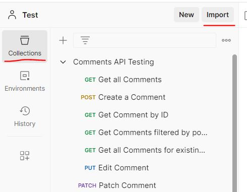
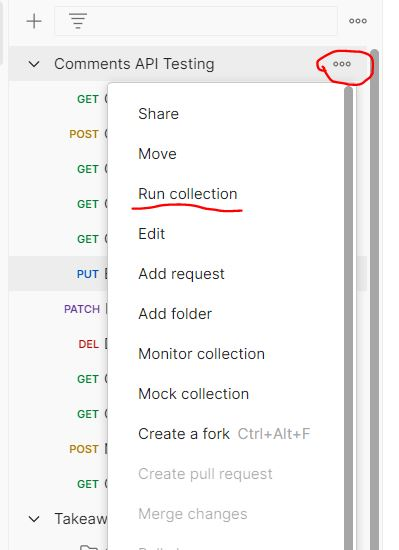
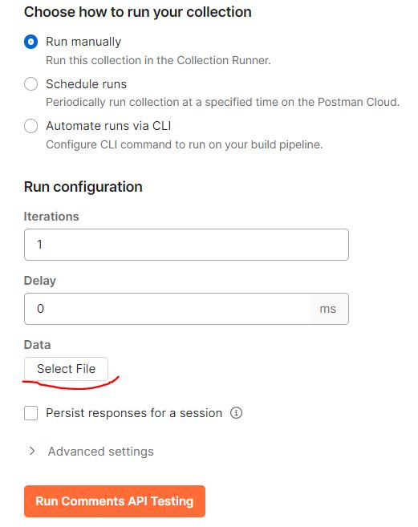
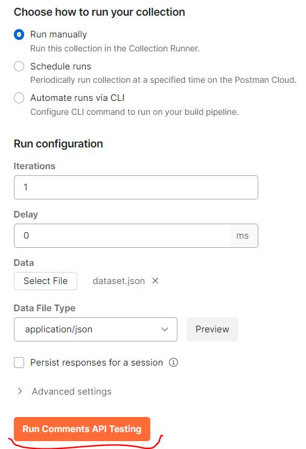
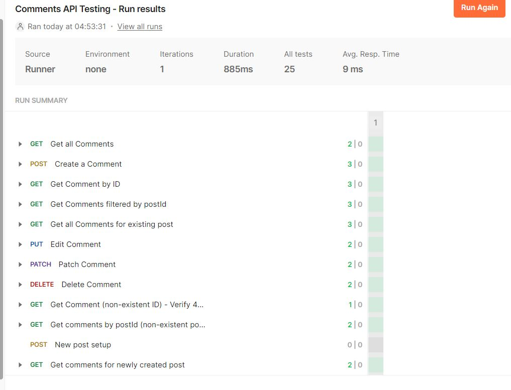
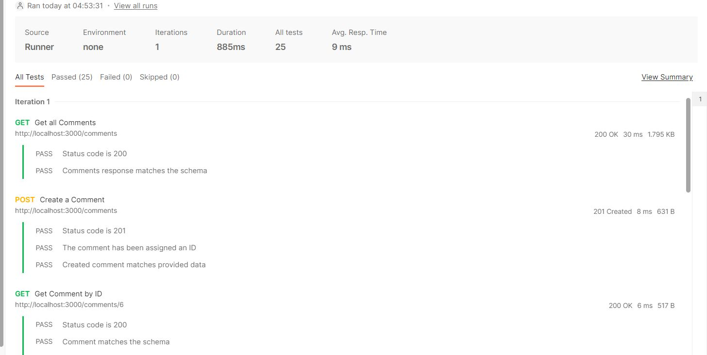

# API Testing

This repository contains an example of API tests with Postman Collection Runner.

For more details, please [follow this link](https://cottony-bosworth-fff.notion.site/API-Testing-Challenge-568fe8bc8ef7405a899fc6036f6cc122?pvs=4).

## To run tests:

1. Clone repository:  
   `git clone https://github.com/nina-si/api-testing.git`

2. Move to project folder:  
   `cd api-testing`

3. Install dependencies:  
   `npm install -g json-server`

4. Start json-server in watch mode:  
   `json-server --watch db.json`

5. Import a collection into Postman:

   

6. In Postman, choose to run collection manually:

   

7. In Data > Select file input choose `dataset.json`:

   

8. Click 'Run Comments API Testing':

   

You can change dataset or play with requests.
Don't forget to stop json-server after test run.

## Test results

After test run, results can be seen:

